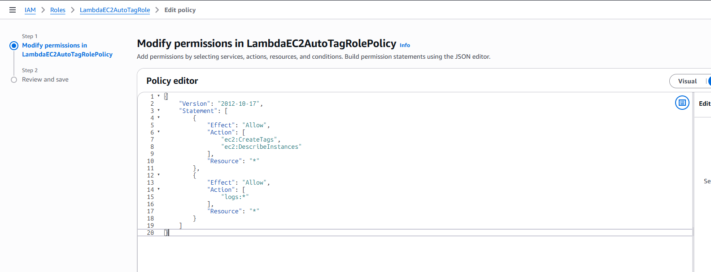

# Assignment 3: Auto-Tagging EC2 Instances on Launch

## Objective

Automatically tag newly launched Amazon EC2 instances for resource
tracking, ownership, and cost allocation using AWS Lambda and Amazon
EventBridge.

## Overview

When an EC2 instance reaches the **Running** state: 1. EventBridge
detects the event. 2. EventBridge invokes a Lambda function. 3. Lambda
extracts the EC2 Instance ID. 4. Lambda adds LaunchDate and Environment
tags. 5. The tagged instance is easier to identify and manage.

## IAM Policy

``` json
{
  "Version":"2012-10-17",
  "Statement":[
    {
      "Effect":"Allow",
      "Action":[
        "ec2:CreateTags",
        "ec2:DescribeInstances"
      ],
      "Resource":"*"
    }
  ]
}
```

Attach the managed policy: - AWSLambdaBasicExecutionRole

## Lambda Code

``` python
Updated code in Lambda_code.py file in task3
```

## EventBridge Rule

``` json
{
  "source":["aws.ec2"],
  "detail-type":["EC2 Instance State-change Notification"],
  "detail":{
    "state":["running"]
  }
}
```

Target: - Lambda Function: AutoTagEC2

## Testing

1.  Launch a new EC2 instance.
2.  Wait 30--60 seconds.
3.  Verify the tags:
    -   LaunchDate
    -   Environment

## Troubleshooting

If you receive:

    UnauthorizedOperation: ec2:CreateTags

Check that: - Lambda uses the `LambdaEC2AutoTagRole` execution role. -
The role has `ec2:CreateTags` permission. - IAM changes have propagated.

## Bonus

Use AWS CloudTrail to identify the IAM user who launched the instance
and automatically create an `Owner` tag.

## Conclusion

This solution automatically tags EC2 instances using an EventBridge rule
and a Lambda function, improving resource tracking, governance, and cost
allocation.


IAM role created for Auto tag for EC2 instance

