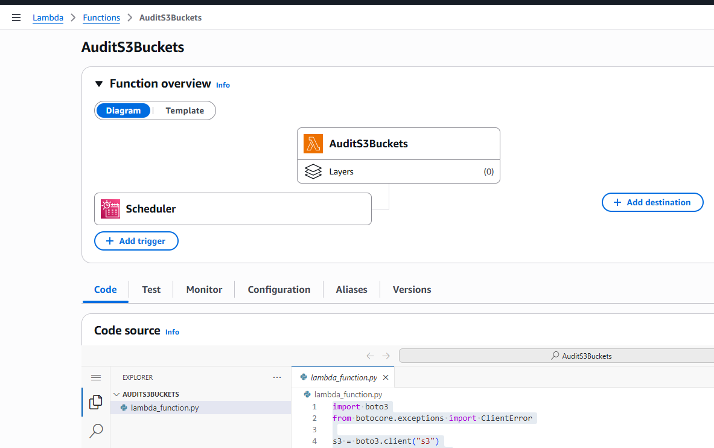
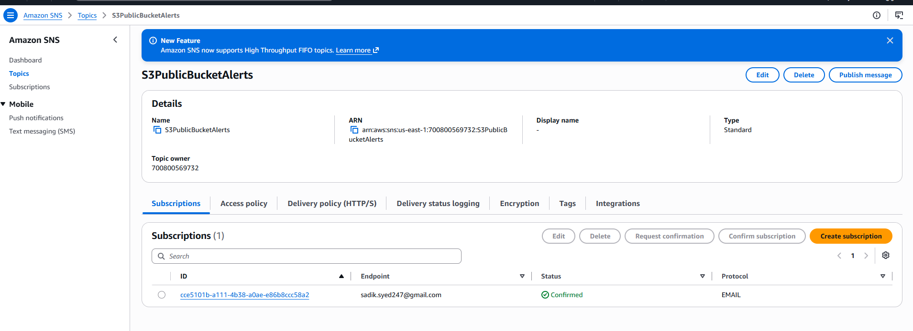
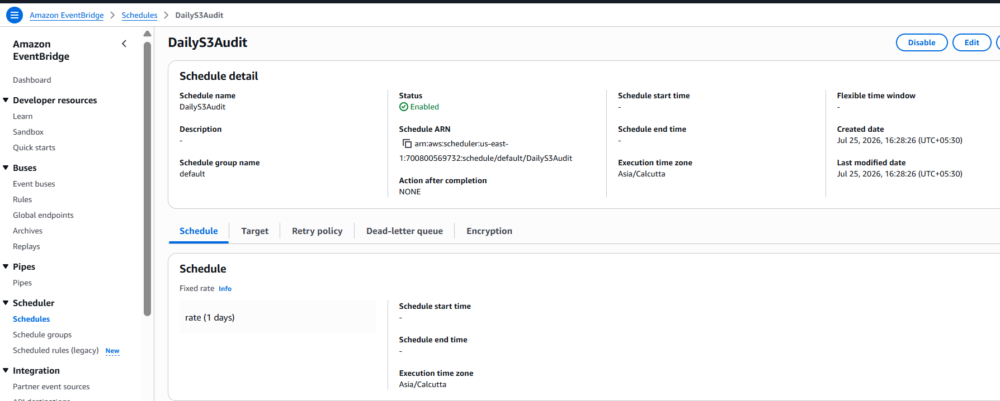
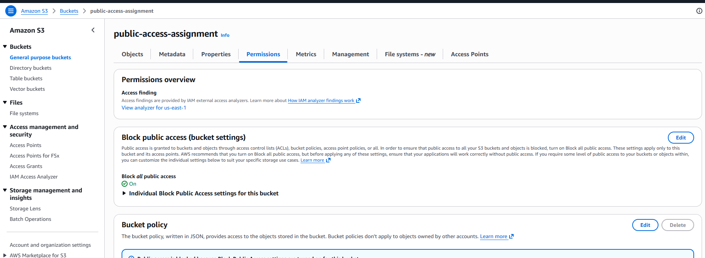
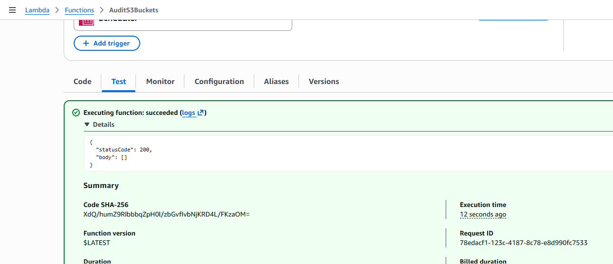
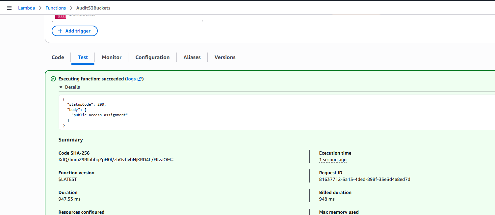
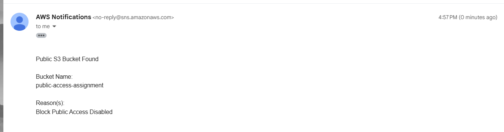

# Assignment 4: Audit S3 Buckets for Public Access and Notify

## Objective

Automatically detect publicly accessible Amazon S3 buckets and send an
email notification using Amazon SNS. The solution checks: - Block Public
Access configuration - Bucket Policy (IsPublic) - Bucket ACLs

The audit runs every day using Amazon EventBridge Scheduler.

## AWS Services Used

-   Amazon S3
-   AWS Lambda
-   Amazon SNS
-   Amazon EventBridge Scheduler
-   AWS IAM
-   Amazon CloudWatch

## Architecture

``` text
EventBridge Scheduler
        │
        ▼
 Lambda Function
        │
        ▼
 List all S3 Buckets
        │
 ┌──────┼───────┐
 ▼      ▼       ▼
Block  Policy   ACL
        │
        ▼
 Public Bucket?
    │
 Yes▼
 SNS Email
```

## Step 1: Create SNS Topic

-   Create a Standard SNS topic.
-   Topic Name: `S3PublicBucketAlerts`
-   Create an Email subscription.
-   Confirm the subscription from your email.

## Step 2: Create IAM Role

Role Name: `LambdaS3AuditRole`

Attach: - AWS managed policy: `AWSLambdaBasicExecutionRole`

Inline policy permissions: - s3:ListAllMyBuckets -
s3:GetBucketPublicAccessBlock - s3:GetBucketPolicyStatus -
s3:GetBucketAcl - sns:Publish

## Step 3: Create Lambda Function

-   Function Name: `AuditS3Buckets`
-   Runtime: Python 3.x
-   Execution Role: `LambdaS3AuditRole`
-   Deploy the provided Lambda code.

## Step 4: Create EventBridge Scheduler

1.  EventBridge → Scheduler → Create schedule
2.  Name: `DailyS3Audit`
3.  Recurring Schedule
4.  Rate-based schedule
5.  Every `1 Day`
6.  Flexible time window: Off
7.  Target: AWS Lambda
8.  Select `AuditS3Buckets`
9.  Create Schedule

## Step 5: Testing

1.  Create a test bucket.
2.  Disable Block Public Access.
3.  Attach a public bucket policy.
4.  Run the Lambda or wait for the schedule.
5.  Verify the SNS email.
6.  Re-enable Block Public Access and remove the policy.

## Expected Result

If no bucket is public:

``` json
{
  "statusCode": 200,
  "body": []
}
```

If a public bucket is found, an SNS email is sent identifying the
bucket.

## Conclusion

This solution automatically audits Amazon S3 buckets daily and notifies
administrators whenever a bucket is publicly accessible, helping improve
AWS security and governance.

========================================
Output- Screenshots

Lambda function created



SNS created to send the Email notification 



Amazon Event Bridge created to triggre the Lamda function 



S3 bucket created with blocking public access



Lambda output ith blocking public access s3 instance



After enable public access


